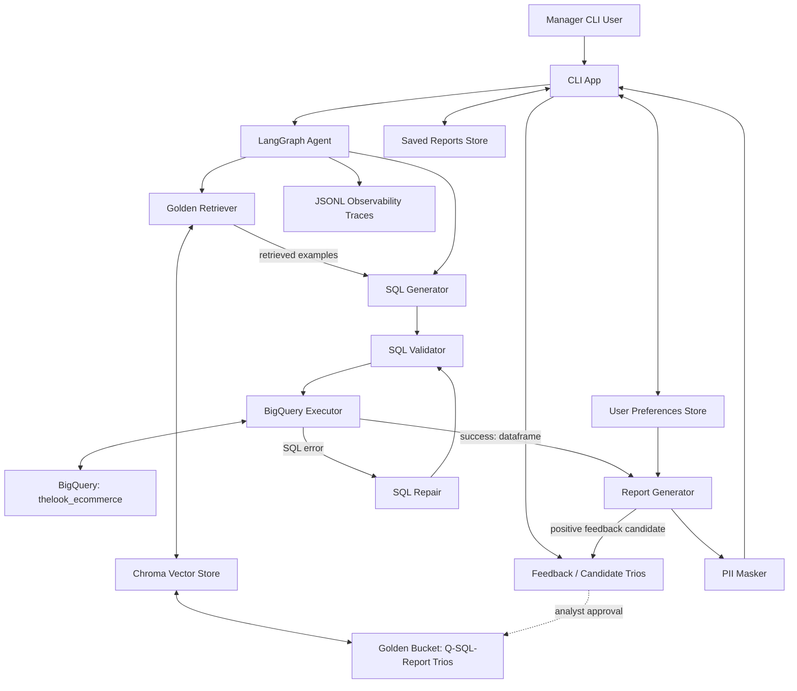

# High-Level Design: Retail Analytics Agent

## 1. Overview

Retail Analytics Agent is a CLI-based data analysis assistant for retail managers.

It accepts natural language business questions, retrieves relevant analyst-approved examples from a Golden Knowledge Base, generates BigQuery SQL, executes the query, and returns an executive-style report.

The prototype is implemented with:

* **LangGraph** for workflow orchestration
* **BigQuery** as the analytical database
* **OpenAI** for SQL generation, SQL repair, and report generation
* **ChromaDB** for Golden Knowledge retrieval
* **JSON/JSONL local stores** for preferences, feedback, traces, and saved reports

---
Reasoning:

- **OpenAI API** — Gemini was initially considered because of the free-tier option, but the setup was blocked by billing/credit limitations. OpenAI was used for the prototype because it was already available and supports reliable structured outputs. Local LLMs via Ollama I didn't consider because of latency for big models or quality for smaller ones.
- **Model: `gpt-4o-mini`** — selected as a low-cost, low-latency model suitable for a PoC/MVP. The full prototype run cost was approximately $0.02 for ~88k tokens. In production, model choice should be re-evaluated based on accuracy, latency, cost, and compliance requirements.
- **ChromaDB** — selected as a lightweight local vector store for the prototype. It supports semantic retrieval through vector similarity search over Golden Bucket embeddings. In production, I would consider a managed or more scalable vector database such as Qdrant, Weaviate, Pinecone, or Vertex AI Vector Search.
___
## 2. Architecture



---

## 3. Main Runtime Flow

1. User enters a question in the CLI.
2. The agent retrieves similar Golden Bucket examples from ChromaDB.
3. The LLM generates BigQuery SQL using:

   * user question
   * schema context
   * business rules
   * retrieved examples
4. SQL is validated before execution.
5. BigQuery executes the query.
6. If SQL fails, the agent attempts repair and retries.
7. The result dataframe is masked for email and phone values.
8. The report generator creates an executive report.
9. Final text is masked again before display.
10. Execution trace is saved to JSONL.

---

## 4. Requirement Coverage

| Requirement           | Implementation                                                                                                                   |
| --------------------- | -------------------------------------------------------------------------------------------------------------------------------- |
| Hybrid Intelligence   | Golden Bucket examples are embedded, stored in ChromaDB, retrieved by semantic similarity, and passed into SQL/report prompts.   |
| Safety & PII Masking  | Email and phone values are masked in dataframes and final text. SQL is restricted to analytical read-only queries.               |
| High-Stakes Oversight | Saved Reports are stored separately from BigQuery. Deletion requires matching report preview and explicit `DELETE` confirmation. |
| User-Level Learning   | User preferences store remembers report format and tone per manager.                                                             |
| System-Level Learning | Positive feedback creates candidate trios for analyst review before promotion to Golden Bucket.                                  |
| Resilience            | SQL validation, BigQuery dry-run/cost guard, repair loop, max retries, graceful failure message.                                 |
| Quality Assurance     | Proposed QA uses golden question tests, SQL validation tests, PII masking tests, and report faithfulness checks.                 |
| Observability         | JSONL traces store run ID, latency, nodes visited, retrieved examples, SQL, errors, retries, and final status.                   |
| Persona Management    | Report tone and format are controlled through config/user preferences without redeployment.                                      |

---

## 5. Golden Bucket Update Strategy

The Golden Bucket is not updated directly by the LLM.

Update flow:

```text
User feedback
    -> candidate trio
    -> analyst review
    -> approved trio
    -> Golden Bucket update
    -> ChromaDB re-index
```

This prevents bad model outputs from becoming trusted examples.

---

## 6. Safety Design

The system uses multiple guardrails:

* SQL prompt rules
* SQL validator
* allowed-table checks
* read-only BigQuery access
* email/phone dataframe masking
* email/phone final text masking
* max bytes billed limit

The final report must never expose customer emails or phone numbers, even if SQL retrieves them.

---

## 7. Error Handling

The SQL execution path supports controlled recovery:

```text
generate SQL
    -> validate SQL
    -> execute SQL
    -> if error: repair SQL
    -> retry up to max_sql_retries
    -> graceful failure if still invalid
```

This avoids UI crashes and prevents unbounded LLM/API costs.

---

## 8. Observability

Each agent run creates a JSONL trace with:

* `run_id`
* total latency
* visited LangGraph nodes
* retrieved Golden examples
* generated SQL
* repaired SQL
* BigQuery errors
* repair attempts
* row count
* final status

This supports debugging and failure analysis.

---

## 9. Setup and Run

See `README.md` for full setup instructions.

Main commands:

```bash
uv sync
uv run python -m app.golden_retriever
uv run python -m app.run_app
```

---

## 10. Notes and Limitations

* The prototype uses OpenAI instead of Gemini due to API/billing constraints.
* Storage is local JSON/JSONL for simplicity.
* Production deployment should move traces, saved reports, feedback, and preferences to managed storage.
* A production version should add authentication, RBAC, centralized logging, and a formal evaluation pipeline.
